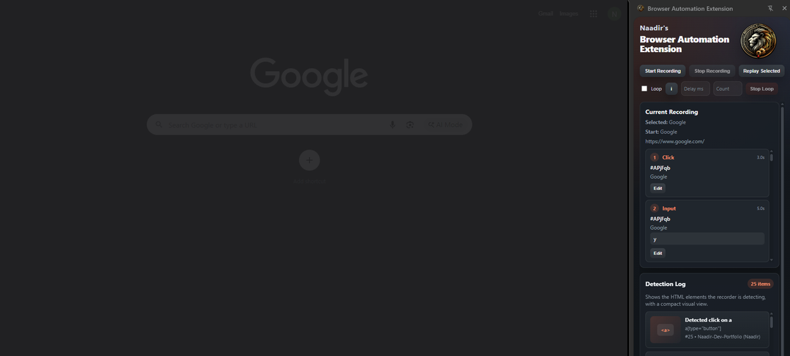

# AI-Article-Sender

> Chrome extension that scrapes any article and sends the full text directly to ChatGPT, Claude, Gemini, or Perplexity.

Built by [Naadir](https://github.com/Naadir-Dev-Portfolio)

---

## Overview

Reading something interesting and want an AI take on it? One click in the side panel scrapes the full article text from the current tab and injects it straight into whichever AI platform you choose — no copy-pasting, no truncation worries. Scraped articles are saved locally so you can re-send or revisit them later without hitting the page again.

---

## Features

- Scrapes article body text from any webpage via an injected content script
- Sends up to 20,000 characters directly into ChatGPT, Claude, Gemini, or Perplexity
- Side-panel UI with per-entry expand/collapse and a persistent article library
- Deduplicates by URL — re-scraping a page updates the existing entry rather than creating a duplicate
- Auto-injects the content script on-demand if the extension was loaded after the tab opened
- Works on any URL including pages opened before the extension was installed

---

## Tech Stack

`JavaScript` · `HTML` · `CSS` · `Chrome Extensions API (Manifest V3)`

---

## Setup

1. Clone or download this repo
2. Open Chrome and go to `chrome://extensions/`
3. Enable **Developer mode** (top-right toggle)
4. Click **Load unpacked** and select this folder
5. Pin the extension and open the side panel from any article page

---

JavaScript · HTML · CSS
